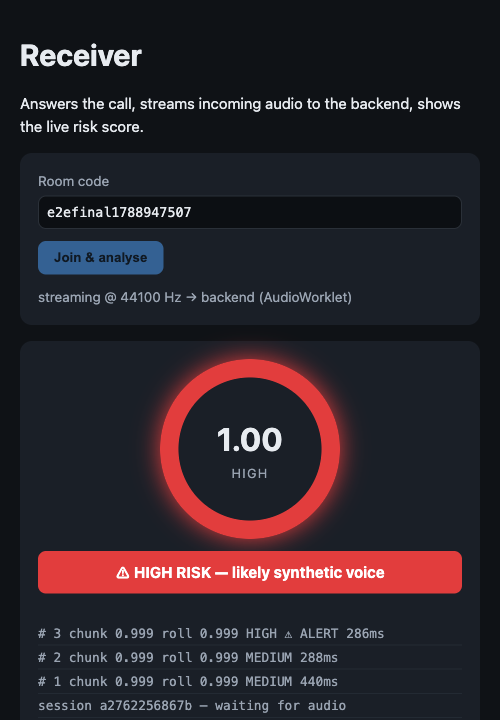

# VoiceGuard

Real-time AI voice-cloning / deepfake detection for live calls. Incoming call audio is
streamed to a backend that runs **wav2vec2 → AASIST** inference on 4 s chunks and returns a
rolling **spoof-risk score**, raising a **HIGH alert** (and firing a webhook) when synthetic
speech is sustained.

- **Detection:** an SSL wav2vec2 frontend (XLS-R / IndicWav2Vec / wav2vec2-base) → vendored
  **AASIST** spectro-temporal graph-attention backend → OC-Softmax → `fake_prob = P(spoof)`.
  The shipped checkpoint (`backend/models/aasist_indicw2v.pt`) is XLS-R-300m fine-tuned on
  4 s crops — `DetectionPipeline` auto-loads whichever frontend the checkpoint bundles.
- **Real-time:** at `chunk_seconds: 4.0` / `hop_seconds: 1.0` (matching the checkpoint's
  training crops), inference runs ~300-500 ms per chunk on CPU — well inside the 1 s hop. The
  WS handler drops stale windows and runs inference off the receive loop so latency stays
  bounded regardless. (No checkpoint / `wav2vec2-base`: real time at the 0.5 s hop instead.)
- **Risk engine:** rolling weighted average over the last 10 chunks; `LOW`/`MEDIUM`/`HIGH`
  thresholds; HIGH latches after 3 sustained chunks; webhook fires once on the transition.
- **Multilingual:** trained on ASVspoof 2019/2021 LA + In-the-Wild + a self-built Indian set
  (IndicTTS genuine vs. content-matched MMS-TTS fakes: hi, ta, te, bn, mr, gu).

Full architecture and the build plan: **[CLAUDE.md](./CLAUDE.md)** · training: **[docs/TRAINING.md](./docs/TRAINING.md)**

## Setup

```bash
pip install torch torchaudio --index-url https://download.pytorch.org/whl/cpu
pip install -r requirements.txt
```

## Run the demo

```bash
uvicorn backend.main:app                    # loads backend/models/aasist_indicw2v.pt if present (else wav2vec2-base, untrained)
#   VG_FEATURE_EXTRACTOR__BACKEND=dummy uvicorn ...   for a light, model-free run
```

Open **http://localhost:8000/** → *Caller* and *Receiver* pages. Enter the same room code on
each, click connect. Speak (or play a clip) into the caller's mic; the receiver's gauge
tracks the rolling spoof risk and banners a HIGH alert when it's sustained.

- `GET /health` · `GET /config` · `POST /score` (multipart `file`) · `WS /ws/stream` · `WS /ws/signal/<room>`

Score a single clip end to end (with a webhook catcher):

```bash
VG_WEBHOOK__ENABLED=true VG_WEBHOOK__URL=http://localhost:9099/hook uvicorn backend.main:app &
python scripts/e2e_demo.py --wav path/to/deepfake.wav --input-sr 16000 --realtime
```

`--realtime` paces frames like a live mic feed; without it the whole clip is sent in a burst
and most analysis windows get dropped as stale (only the newest pending one is scored), which
is enough to see *a* score but not to reliably latch a sustained HIGH.

### Browser demo walkthrough

1. `uvicorn backend.main:app` — open **http://localhost:8000/** in two tabs (or two devices on
   the same network): [`/caller.html`](http://localhost:8000/caller.html) and
   [`/receiver.html`](http://localhost:8000/receiver.html).
2. Enter the same room code on both (default `demo`), click **Start mic & connect** on the
   caller and **Join & analyse** on the receiver. They auto-connect over WebRTC via
   `/ws/signal/<room>` (first joiner offers, second answers) — no manual SDP copy-paste needed.
3. Speak into the caller's mic, or play a synthetic/cloned-voice clip *into* the mic (or route
   it through a virtual audio cable). The receiver captures the remote `MediaStream`, frames
   it into ~85 ms PCM via an `AudioWorklet`, and streams it to `/ws/stream`.
4. The receiver's gauge tracks the rolling risk score in real time and turns red with an
   alert banner once `HIGH` sustains for 3 consecutive chunks — at which point the backend
   also fires the configured webhook once.

Verified end to end with a real WebRTC connection (two Chrome contexts, caller mic fed from a
synthetic AI-voice clip via `--use-file-for-fake-audio-capture`): connect → PCM stream → gauge
→ HIGH banner → webhook, all firing correctly at `chunk_seconds: 4.0` / `hop_seconds: 1.0`.



## Train the detector

The live pipeline auto-loads `backend/models/aasist_indicw2v.pt`. To produce one, run
`notebooks/train_kaggle.ipynb` on a GPU (Kaggle P100/T4) — it pulls data from HF, generates
content-matched fakes, fine-tunes wav2vec2 + AASIST with RawBoost + OC-Softmax, and evaluates
per dataset/language. Download the checkpoint into `backend/models/`. See
[docs/TRAINING.md](./docs/TRAINING.md). Locally:

```bash
python scripts/download_datasets.py --only asvspoof2019,indictts,fleurs
python scripts/generate_indian_fakes.py --n 1200
python scripts/prepare_manifests.py
python -m training.train --config training/config_train.yaml          # e2e on GPU, frozen on CPU
python -m training.evaluate --checkpoint backend/models/aasist_indicw2v.pt \
    --manifest data/manifests/eval.tsv --by dataset,language
```

## Layout

| Path | What |
|---|---|
| `backend/inference/` | `Wav2Vec2Extractor`, vendored AASIST, classifier, detection pipeline |
| `backend/audio/` | PCM decode + streaming chunker |
| `backend/scoring/` · `backend/alerts/` | rolling risk engine · webhook dispatch |
| `backend/api/` · `backend/main.py` | FastAPI REST + WebSocket (`/ws/stream`, `/ws/signal`) |
| `frontend/` | WebRTC caller/receiver + live dashboard (AudioWorklet capture) |
| `training/` | feature cache, RawBoost, losses, EER/t-DCF, `EndToEndDetector`, train, evaluate |
| `scripts/` | dataset download, fake generation, manifests, benchmarks, demo checks |
| `config/config.yaml` | thresholds, model id, sample rate |

## Constraints

- iOS can't intercept native calls (Apple sandbox) → VoiceGuard runs at the WebRTC/browser
  layer, which works everywhere including iOS Safari. In production the feed comes from a
  VoIP gateway / PBX (SIPREC, Twilio Media Streams, …); the browser demo stands in for that.
- `wav2vec2-base` is English-pretrained; the multilingual frontends (XLS-R, IndicWav2Vec)
  are stronger on Indian-language calls but need `hop_seconds: 1.0` on CPU. See CLAUDE.md §9.

## Attribution

AASIST backend vendored from [WeDefense](https://github.com/zlin0/wedefense) (`aasist.py`, MIT,
NAVER Corp / Hemlata Tak). Built with Claude Code.
